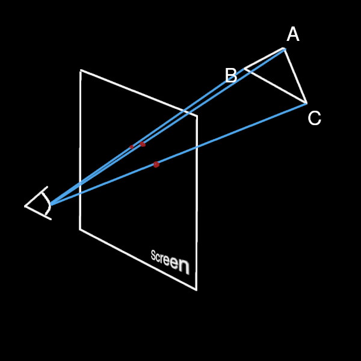
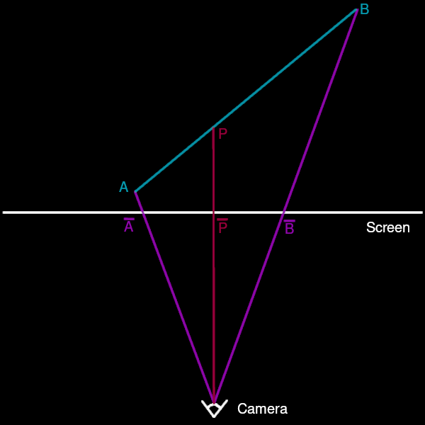

+++
title = 'The PlayStation Texture Wobble'
date = '2025-08-02'
draft = true
toc = true
tocBorder = true
math = true
[params]
  author = "Jordan Emme"
+++

Where I ramble on about the PlayStation texture affine interpolation and a few bits on
how to render a triangle in software. [Some hacky code cobbled together for illustration
purposes](https://github.com/JordanEmme/s0-wren/).

## What's this about?

I just wanted to write a blog post about something funny I have learned relatively recently. If you
have played any PlayStation 1 games, you'll know that the graphics --- the textures in particular
--- seem to always contort and distort in strange ways as the viewing angles of the objects change.
For illustrative purposes (and for fun), I quickly slapped together a tiny software renderer I wrote
which somewhat emulates this behaviour on a rotating cube. Here is the pixelated output:



Notice in particular the jarring distortions along a diagonal of each square face of this cube (this
happens to be the diagonal along which each square is partitioned into two triangles). Now, I am
not pretending that what I hacked together is a faithful representation of how the PlayStation
does all its rendering in any way, shape, or form. That being said, the fundamental reason why my
renderer exhibits this warp/wobble of the texture during the cube rotation is the same as why this
phenomenon appeared on the console.

Should you want to see a more faithful example of PlayStation graphics, do yourself a favour, and
watch a walkthrough of [some classic](https://www.youtube.com/watch?v=sbKBbTqTeT8), or better yet,
go and play some (if you can get past the particular kind of jank that usually came with games of
that particular era that is).

## How Did the PlayStation Compute Texture Coordinates?

To the best of my understanding, the factor which most contributes to the texture wobble effect in
PlayStation 1 games is the way the texture coordinates are being computed. If you know the basics of
how to rasterise a triangle, and what UV/texture coordinates are in the context of 3D meshes, feel
free to jump to subsection about
[the PlayStation texture coordinates computation.](#the-playstation-texture-coordinates-computation)
Otherwise, please read on as I try to make a simple, self-contained, summary of what is needed to
understand the issue.

### Basics of Triangle Rasterisation

First a little refresher (or crash-course) on how 3D is being renderer on screen through
rasterisation (there are other ways to render 3D objects on a 2D display, notably ray-tracing,
but we are specifically talking about rasterisation here). I'll only explain what is
strictly necessary for this post to be self contained, but should you want some more
details, or even write your own first renderer, [here is a great first introduction to the
matter](https://github.com/ssloy/tinyrenderer).

What is rasterisation in our context? Put simply, it is the act of representing a triangle (or any
geometrical object really) in 3D space as a bunch of pixels on a 2D display. Let us precise the
concepts with some C code (with no regard for performance: I rather try to organise code and data
in a didactic way).

```c
typedef struct vec3 {
  float x;
  float y;
  float z;
} vec3;

typedef struct tri3D {
  vec3 pos[3];
} tri3D;
```

We simply define a triangle in 3D space `tri3D` as three `vec3`s (or `float3` or whatever the hell
you want to name a vector in \\(\mathbb{R}^3)\\).

Of course, our displays are not 3D, but 2D, so we have to project these onto a 2D space. Let us
keep things simple and not worry too much about the actual "physical" properties of our display
(resolution, curvature if you have a CRT or a Gamerz™ ultrawide) for now, and consider a plane in
the 3D space which will represent the display. We'll call it the screen. There are three main steps:
1. Project the triangle to the screen.
1. Compute a bounding box for the projected 2D triangle.
1. Determine which pixels (with the appropriate discretisation of the plane) in the bounding box are
inside the projected triangle: these are the ones to be drawn.

---
{data-content=Projection}

There are many ways to project the three-dimensional space \\(\mathbb{R}^3\\) to the two-dimensional
space \\(\mathbb{R}^2\\). Of these, the two most notable ones in the domain of computer graphics
are the orthogonal projection and the perspective projection. The careful reader will have noted
that I am implying uniqueness of these projections through the use of the definite article: this is
because it is traditional to fix the screen to be the plane with normal \\(\vec{e_z} = (0,0,1)\\)
and containing the point \\(O = (0,0,\pm 1)\\) as expressed in the observer's/camera's coordinate
system. In other words, the camera is looking in the direction of the vector \\(\pm \vec{e_z}\\)
and therefore, \\(z\\) (or sometimes \\(-z\\)) represents the depth.

> __Remark__: The orientation is dependent on some choice of coordinate systems as there is not
a single convention in the world of 3D modelling and computer graphics. Some software assume a
direct (also called right-hand) orientation --- which would be my preference, given this is the most
natural way to do things, mathematically speaking --- and some assume a left-hand orientation. For
the camera orientation, I tend to prefer having \\(x\\) pointing right,  \\(y\\) pointing down, and
\\(z\\) pointing forward. This makes the \\(xy\\) orientation consistent with the canonical display
orientation (inherited from scanlines era), the look position to be positive, and the overall
coordinate system to be direct.

In this context, the orthogonal projection is simply the function:
\\[
\begin{align*}
p:\mathbb{R}^3 &\rightarrow \mathbb{R}^3 \\\
     (x, y, z)&\mapsto     (x, y , 1) 
\end{align*}
\\]

This can be a very useful in certain cases, in particular in 2D games where you still want some
depth information between your sprite but don't want that to be reflected in any perspective in the
rendering. For a 3D game to provide a sense of depth and distances however, this is not the way to
go. We instead use a perspective projection as (brilliantly) illustrated below.



In this instance, the projection is simply:
\\[
\begin{align*}
p:\mathbb{R}^3\setminus P_z &\rightarrow \mathbb{R}^3 \\\
     (x, y, z)&\mapsto     \left(\frac{x}{z}, \frac{y}{z} , 1\right) 
\end{align*}
\\]

where \\(P_z\\) is the plane \\(\left\\{ (x, y, 0) \ | \ (x, y) \in \mathbb{R}^2 \right\\}\\).

Note the constraint here of needing to have \\(z \neq 0\\). This is fine for our purpose, we would
not want to render things too close to the camera anyways, so if \\(z\\) is too small we can just
chuck it away (well, sort of...).

For reasons that will become clear later, we should also store the value \\(\frac{1}{z}\\),
sometimes denoted \\(w\\) (for weight), so one could compute the projected coordinates in the
following way.

```c
vec3 proj(vec3 v) {
  float w = 1.f / v.z;
  return (vec3) {.x = v.x * w, .y = v.y * w, .z = w};
}  
```

---
{data-content="Bounding Box"}

Now we have some projected coordinates --- as well as \\(w = \frac{1}{z}\\) for later purposes ---
we need to know which pixels to shade. The idea is basically to bound the projected triangle in a
box (axis-aligned, so in this context, whose sides are parallel to the screen sides). So we have to
fill in a struct which could look something like:

```c
typedef struct BBox {
  uint16_t minRow;
  uint16_t maxRow;
  uint16_t minCol;
  uint16_t maxCol;
} BBox;
```

Essentially, one needs to map the triangle vertices on the screen to points on the display (i.e.
apply the right scaling --- which depends on the resolution --- and translation to move the origin
from the centre of the screen to the top-left of the display: the display is a 2D array of pixels so
it helps to set the origin in the usual way). 


---
{data-content="Checking if a Point is in a Triangle"}

Now we can essentially iterate over every pixel in the bounding box, and check whether the
corresponding pixel is in the triangle. If it is in the triangle, we need to draw it, else we
can ignore it. Let us expose how to check whether a point \\(P\\) in  \\(\mathbb{R}^2\\) is
in a triangle \\(ABC\\). If \\(ABC\\) is not degenerate (*i.e.* \\(\overrightarrow{AB}\\) and
\\(\overrightarrow{AC}\\) are not colinear), then one can express the coordinates of \\(P\\) as a
weighed average of the coordinates of \\(A\\), \\(B\\), and \\(C\\).

More formally, say our plane has origin \\(O\\), then
\\[
\exists!\ (m_A, m_B, m_C) \in \mathbb{R}^3 \setminus \left\\{(0,0,0)\right\\},\quad \left\\{
\begin{align*}
&\overrightarrow{OP} =  m_A \overrightarrow{OA} + m_B \overrightarrow{OB} + m_C \overrightarrow{OC}
\\\
&\text{and} \\\
& m_A + m_B + m_C = 1.
\end{align*}
\right.
\\]

These three quantities \\(\left(m_A, m_B, m_C\right)\\) are the barycentric coordinates of \\(P\\)
in the plane defined by the triangle \\(ABC\\). It is easy to prove the following:

\\[
P \in ABC \Leftrightarrow m_A \geq 0 \ \text{and} \ m_B \geq 0 \ \text{and} \ m_C \geq 0
\\]

Thus, assuming we can compute the barycentric coordinates of any point w.r.t. a triangle, it is
an easy check whether the point is inside or outside the triangle. So now the question is how to
compute the barycentric coordinates. I won't derive the computations here, but one possible, and
elegant, formulation is the following:

> ##### Barycentric Coordinates Formula
> \\[
> \begin{aligned}
> m_A &= \frac{\text{SignedArea}(PBC)}{\text{SignedArea}(ABC)}, \\\
> m_B &= \frac{\text{SignedArea}(APC)}{\text{SignedArea}(ABC)}, \\\
> m_C &= \frac{\text{SignedArea}(ABP)}{\text{SignedArea}(ABC)}. 
> \end{aligned}
> \\]

Furthermore, the [signed area](https://en.wikipedia.org/wiki/Signed_area) of a triangle \\(ABC\\)
can easily be computed as the determinant of a \\(3\times 3\\) matrix as follows:

> ##### Signed Area Formula
> \\[
> \text{SignedArea}(ABC) = \frac12 \left|
> \begin{array}{ccc}
> x_A & y_A & 1 \\\
> x_B & y_B & 1 \\\
> x_C & y_C & 1 
> \end{array}
> \right|.
> \\]

> __Remark__: Seeing as we are only interested in the signs of the barycentric coordinates, it is
not technically necessary to compute them at that stage. However, seeing the important role that
they play both in depth and texturing, we decide to introduce them here.

---
{data-content="A Quick Word on Depth"}

I won't get into much detail here, as at that point, we already have all that is necessary to
understand the issue with the PlayStation texturing. That being said, I'll just mention depth *en
passant*, as it is both fundamental to rasterisation, and relevant to the PlayStation's hardware
shortcomings.

Imagine you have a 3D space filled with a multitude of triangles you wish to render, via
rasterisation, to a 2D display. Up until now, we have only looked at how to determine whether a
point on the display should be seen as being part of a 3D triangle when appropriately projected.
However, should another triangle stand between the first one and the camera, how can we then know
what to draw to the display?

A standard method consists in having a 2D array of floating points the same dimension as the
display, called the Z-buffer, which stores the depths of the drawn pixels. In essence, once a pixel
on display is found to lie in a projected triangle, we can compute the point in the 3D triangle
which best approximates the inverse projection of that pixel. The \\(z\\)-coordinate of that point
is the depth associated to that pixel, and we can compare it against what is stored in the Z-buffer
to decide whether this is in front or behind what has already been drawn, and then render and update
the Z-buffer accordingly.

We will touch a bit more on how to compute that depth properly in later sections, but as a side
note, it seems the PlayStation hardware did not have a dedicated Z-buffer (which seems somewhat
staggering to me for a 3D-first console, but I don't know the ins and outs of that decision and
which trade-offs the engineers had to make then). As a consequence, PlayStation game developers had
to implement a Z-buffer in software for their 3D games...

---
{data-content="Summary"}

Here is a non-detailed, half C, half pseudo-code, snippet to give a summary of the procedure thus
far.

```c
for (size_t i = 0; i < numTriangles; ++i) {
  tri3D tri = triangles[i];
  tri3D projTri;
  BBox box = {NUM_ROW, 0, NUM_COL, 0};
  for (int j = 0; j < 3; ++ j) {
    vec3 vertPos = tri.pos[j];

    vec3 projPos;
    float w = 1.f / vertPos.z;
    projPos.x = w * vertPos.x;
    projPos.y = w * vertPos.y;
    projPos.z = w;

    projTri.pos[j] = projPos;
    update_box(&box, vertPos.x, vertPos.y);
  }

  for (int row = box.minRow; row <= box.maxRow, ++row) {
    for (int col = box.minCol; row <= box.maxCol, ++row) {
      if (pixel_is_in_tri(row, col, projTri)) {
        float depth = get_z(row, col, projTri);
        if (depth < zBuff[row * NUM_COL + col]) {
          shade(row, col, projTri);        
          zBuff[row * NUM_COL + col] = depth;
        }
      }
    }
  }
}
```

> __Remark__: All this is obviously very much simplified when compared to:
> 1. What should be done in practice should you want to write an efficient and reliable software
renderer.
> 1. What GPUs actually do.
>
> In particular, and even in the extremely restricted context we are in (no transparency, no light,
no shadows etc...), one should be mindful of a few extra things such as clipping triangles properly
when they are not fully in the view frustum, possibly culling the backfaces (triangles whose normals
point "away" from the camera) and so on. I did not bother in this example as I knew the cube would
always be in view and is only comprised of 12 triangles...

Let us dig a bit more into what should happen in that `shade` function in the next section.

### How Texturing Works

This is all well and good, and with what we have so far we can determine which pixel needs shading
(and which triangle this is from), but this say nothing of which colour to chose for said pixel.

There are a bunch of factors that come into play here (where the light sources are, which type they
are, what are the material properties of the triangle, whether it is occluded *etc etc...*) but we
are solely focusing on texturing, *i.e.* mapping a 2D image/pattern onto our 3D model.

At the heart of this is the parametrisation of surfaces. For an introduction and formal overview
of the relevant bits in the context of computer graphics and computational geometry, one can start
[here](https://graphics.stanford.edu/courses/cs468-05-fall/Papers/param-survey.pdf). Let me however
try and explain the main idea briefly.

Given that we want to map a 2D image onto a 3D surface, a natural idea is to try and associate
points of the 2D plane \\(\mathbb{R}^2\\) which cover the image onto the 3D surface \\(S\\). In
general terms, we which to get a function:

\\[
\varphi: \mathscr{D} \subset \mathbb{R}^2 \mapsto \mathscr{S}
\\]

where \\(\mathscr{D}\\) is a *nice* (in general that means a finite union of bounded domains for
our purposes) subset of the euclidean plane. The parametrisation function \\(\varphi\\) should
additionally have good properties (often, being as close to being conformal or isometric as
possible). Additionally, this function should be surjective (*i.e.* every point of the co-domain
\\(S\\) can be reached as a image of the function).

These parametrisation can take many forms, and, even in the context of computer
graphics and modelling,  one could have surfaces which are entirely defined
via such objects with polynomial or rational functions (see, for instance
[NURBS](https://en.wikipedia.org/wiki/Non-uniform_rational_B-spline)).

Here however, we do not handle such surfaces. Instead, our surfaces are defined as a union of
polygons (and let's just reduce that to triangles specifically). We can thus do things a bit
backwards, in the following sense:

Seeing as triangles are "flat" (*i.e.* they are always planar), we can (and should) restrict
ourselves to piecewise-affine parametrisations on these triangles, so as to preserve the barycentric
coordinates. Formally, we want parametrisations such that, for any 2D triangle \\(abc\\) in the
domain \\(\mathscr{D}\\), and any point \\(p\\) with barycentric coordinates \\(\left( m_a,
m_b, m_c \right)\\), the parametrisation \\(\varphi\\) satisfies
\\[
\varphi(p) = m_a \varphi(a) + m_b \varphi(b) + m_c \varphi(c).
\\]
In this context, the texture coordinates of vertices in 3D space are the pre-images of these
vertices by the parametrisation \\(\varphi\\). It is thus easy to compute the pre-image of any point
in the 3D triangle, should we know its barycentric coordinates, by just computing
\\[
m_A \varphi^{-1}(A) + m_B \varphi^{-1}(B) + m_C \varphi^{-1}(C).
\\]

Long story short, to get the texture coordinate of any point in a 3D triangle, it is enough to know
the texture coordinates of the vertices, and we can just interpolate them by expressing the point in
the triangle with barycentric coordinates relative to the triangle vertices.

## The PlayStation Texture Coordinates Computation

As it turns out, the Playstation was computing texture coordinates incorrectly (or rather, made an
approximation which did not turn out to be so good), by using affine interpolation, directly from
the screen space. Let us detail what this looks like and why it is yields wrong results.

### Affine Interpolation

Let \\(ABC\\) be a non-degenerate triangle in 3D space and let us denote its projection
to the 2D screen space as \\(\overline{A}\overline{B}\overline{C}\\). Then, for a pixel
with 2D screen coordinates \\(\overline{P}\\), we compute the barycentric coordinates
\\(\left(m_{\overline{A}}, m_{\overline{B}}, m_{\overline{C}}\right)\\) with the [aforementioned
formula](#barycentric-coordinates-formula).
Let us denote \\(a\\), \\(b\\), and \\(c\\) the respective texture coordinates of \\(A\\), \\(B\\),
and \\(C\\). We compute the affine interpolation of these texture coordinates with the barycentric
coordinates \\(\left(m_{\overline{A}}, m_{\overline{B}}, m_{\overline{C}}\right)\\), meaning we
compute the texture coordinate \\(p\\):

\\[
p =  m_{\overline{A}} a + m_{\overline{B}} b + m_{\overline{C}} c.
\\]

So what is the issue here? The issue is that we compute the interpolation of the texture coordinates
using the barycentric coordinates in __*2D screen space*__ and not __*3D world space*__. This
matters a great deal in our case, since we used a perspective projection to go from 3D to 2D
space and as such, the barycentric coordinates in 2D not only have no reason to be the same as
the 3D space one, but additionally, the texture coordinates do not change linearly *w.r.t* vertex
coordinates \\(x\\), \\(y\\), and \\(z\\) but rather \\(x\\), \\(y\\), and \\(w = \frac{1}{z}\\) in
that projected space.

The following sketch should help illustrate the issue, from 2D to 1D space:



From this sketch, it is hopefully obvious that \\(\overline{P}\\) is the middle of
\\(\left[\overline{A}, \overline{B}\right]\\), or, in other words, its barycentric coordinates are
\\(\left(\frac12, \frac12\right)\\), but its pre-image \\(P\\) under the perspective projection is
not the middle of \\(\left[A, B\right]\\). So how do we fix this?

### The Correct Interpolation

As mentioned, in the previous subsection, the crux of the error is to assume that the barycentric
coordinates in 3D and 2D space coïncide. Let us show how they are actually linked, and what that
means for the texture coordinate computation with as elementary a computation as possible.
Start with the 3D triange \\(ABC\\) which is both non-degenerate and lies in the positive half-space
\\[
\left\\{(x, y, z), \\, (x,y) \in \mathbb{R}^2 \text{ and } z > 0\right\\}.
\\]

Let \\(P\\) be a point in the triangle \\(ABC\\) with barycentric coordinates \\(\left(m_A, m_B,
m_C \right)\\) be the barycentric coordinates. Let \\(\overline{A}\overline{B}\overline{C}\\) be the
projected triangle on the screen and \\(\overline{P}\\) be the projection of \\(P\\) onto that same
screen. Denote \\(\left(m_{\overline{A}}m_{\overline{B}}m_{\overline{C}}\right)\\) the barycentric
coordinates of \\(\overline{P}\\) in \\(\overline{A}\overline{B}\overline{C}\\).

Let us first write:

\\[
m_A A + m_B B + m_C C = P
\\]

which is implies that

\\[
\left\\{\begin{aligned}
& z_A m_A \overline{A} + z_B m_B \overline{B} +z_C m_C \overline{C} = P \\\
& \text{and} \\\
& z_A m_A + z_B m_B + z_C m_C = z_P
\end{aligned}\right.
\\]

which, in turn, implies that

\\[
\left\\{\begin{aligned}
& \frac{z_A m_A}{z_P} \overline{A} + \frac{z_B m_B}{z_P} \overline{B} + \frac{z_C m_C}{z_P}
\overline{C} = \overline{P} \\\
& \text{and} \\\
& \frac{z_A m_A}{z_P} + \frac{z_B m_B}{z_P} + \frac{z_C m_C}{z_P} = 1
\end{aligned}\right.
\\]

hence
\\[
\overline{m_A} = \frac{z_A m_A}{z_P} ,\\,
\overline{m_B} = \frac{z_B m_B}{z_P} ,\\,
\overline{m_C} = \frac{z_C m_C}{z_P}.
\\]

From here on, it is clear that if we wish to interpolate the texture coordinates of point
\\(\overline{P}\\), we need to compute the depth \\(z_P\\) so as to infer the barycentric
coordinates of point \\(P\\) in 3D space. 


## Conclusion

